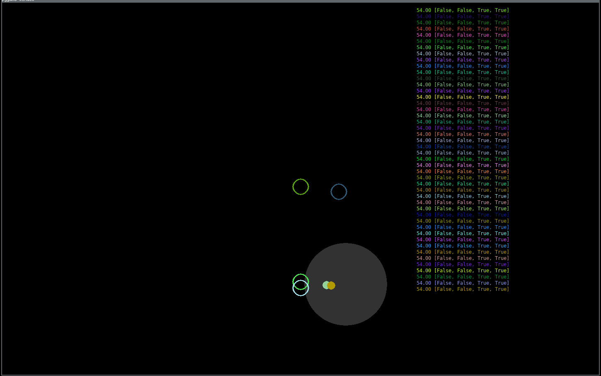

# Experiments with NEAT and NN

Uses `Python3` and `pygame`. This project is not performance oriented.
Its sole purpose is training neural networks on trivial 2D games.



# How to run

```bash
# Install Python3
make venv
make run
```

# How to extend

Check out `neatnn/pygame.py` and `neatnn/circular_movement.py`.
I tries to split the concerns into reusable modules.
However, this needs a little overhaul. Essentially you just have to
implement new `pygame.Game` and `pygame.Player` subclasses and
swap the imports in the `main.py`.

## Have a `NEAT` day and feel free to contribute. All improvements are appreciated.
